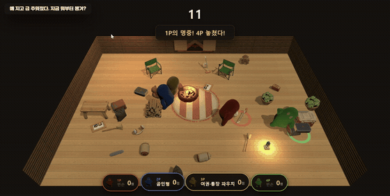
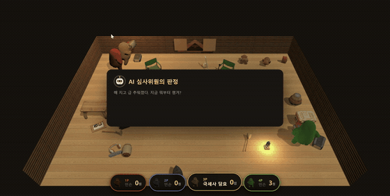
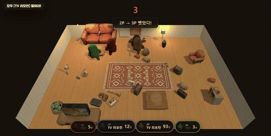
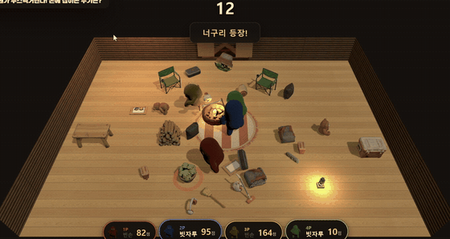
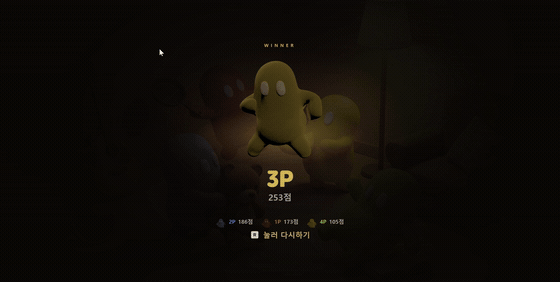

# 잡아라! 코지 룸 🛋️

**엉뚱한 주제에 맞는 물건을 잡아라** — 뺏고, 던지고, AI 심사위원에게 채점받는 물리 난투 파티 게임.
노트북 한 대로 최대 4인, 설치 없이 브라우저에서 바로 시작한다.

### ▶ [지금 플레이하기](https://utact.github.io/cozy-room/) · [플레이 영상](https://www.youtube.com/watch?v=ht-DOUPZ4hk)


---

## 어떤 게임인가

라운드마다 주제가 하나 뜬다. **"집에 불났다! 하나만 들고 튀어라!"** 같은 것들이다.
12초 안에 바닥에 널린 물건 중 가장 그럴듯한 걸 손에 들고 있으면 된다.

물론 남들도 같은 걸 노린다.



같은 물건을 동시에 잡으면 **줄다리기**가 걸린다. 더 세게 버둥거린 쪽이 가져간다.
남이 든 걸 뺏고 싶으면 아무거나 집어서 **던져 맞히면** 된다.
맞은 사람은 들고 있던 걸 놓친다.

## 그리고 AI가 채점한다

버저가 울리는 순간 손에 든 물건이 그대로 제출물이 된다.



> 층간소음 복수전에 **빗자루** — *"손잡이로 천장 쿵쿵. 대한민국 표준 복수법이다. 이견 없다."*
>
> 같은 주제에 **쿠션** — *"천장에 던지면 소리 없이 떨어진다. 세상에서 가장 조용한 복수다."*

## 하나가 모자란 라운드

3라운드 중 한 번은 **모두가 같은 물건 하나를 노린다.** 그런데 그 물건은 인원수보다 딱 하나 적게 놓인다.



의자 뺏기 게임과 같아서 반드시 한 명이 남는다.
게다가 방에는 **위에서 보면 헷갈리는 닮은꼴**이 함께 깔려 있어서,
급하게 집으면 엉뚱한 걸 들고 당당히 서 있게 된다.

## 훼방꾼이 끼어든다

2라운드부터는 맵마다 다른 사건이 터진다.
캠핑장에서는 **너구리가 물건을 물고 도망친다.** 되찾으려면 던져서 맞혀야 한다.



| 코지 거실 | 오토캠핑 데크 |
|---|---|
| 🌪️ **누가 또 창문 안 닫았어!** — 창가를 지나가면 떠밀린다 | 🦝 **너구리가 물어간다!** — 던져서 맞혀야 되찾는다 |
| 🏠 **윗집에서 또 쿵쿵거려!** — 몸도 물건도 들썩인다 | 🌧️ **비 온다, 발밑 조심!** — 미끄러워 방향 전환이 밀린다 |
| 🌑 **정전이야!** — 물건이 실루엣만 보인다. 잡아봐야 정체를 안다 | |

## 3라운드 합산으로 우승자를 가린다



---

## 조작

노트북 한 대를 둘이 나눠 쓴다. 왼쪽이 1P, 오른쪽이 2P. 빈자리는 AI 봇이 채운다.

| | 이동 | 잡기 / 던지기 |
|---|---|---|
| **1P** | `W` `A` `S` `D` | `Space` |
| **2P** | 방향키 | `Enter` |

로비에서 자기 **잡기 키**를 누르면 참가, `B`로 AI 봇 추가, `R`로 시작한다.
**점프는 없다.** 테이블이나 소파 위에 놓인 물건도 그냥 집을 수 있어서 필요가 없다.

## 로컬 실행

```bash
npm install
npm run dev      # localhost:5173
```

Node.js 18+, WebGL2를 지원하는 최신 브라우저(Chrome / Edge 권장).

## 사용 기술

| 영역 | 도구 |
|---|---|
| 기획·코드·검증 | Claude Code (Claude Opus) |
| 3D 캐릭터·프롭·가구 | Meshy AI |
| 2D 키 비주얼·로고 | Higgsfield |
| 렌더링 · 물리 | Three.js · Rapier |
| 효과음 · BGM | WebAudio 실시간 합성 |

개발 과정과 AI 활용 내역은 [AI 활용 기술 문서](docs/AI활용기술문서.md),
게임 규칙은 [게임 소개 문서](docs/게임소개.md)에 정리되어 있다.
